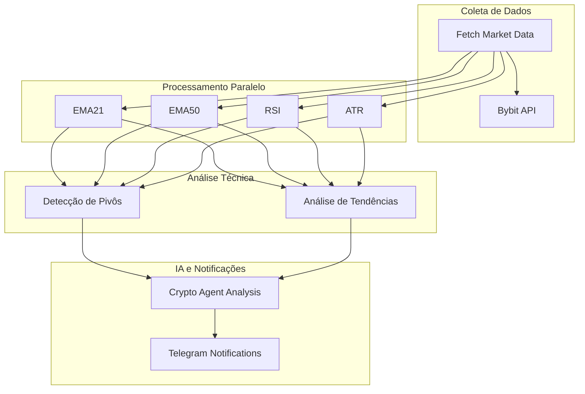
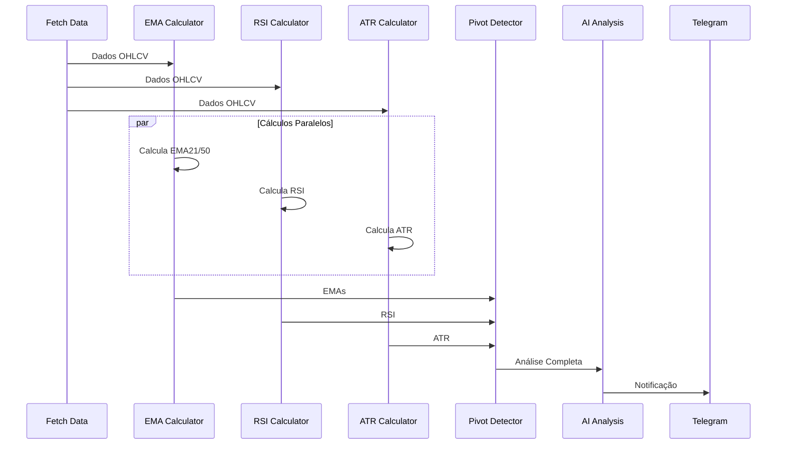
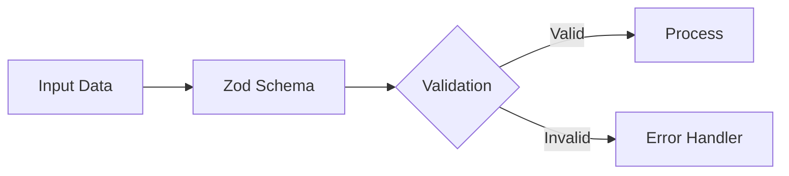

# Análise de Mercado Cripto - Documentação Técnica

## Visão Geral

Este documento descreve o workflow de análise de mercado cripto, uma solução robusta que combina análise técnica tradicional, detecção de padrões, análise via IA e sistema de notificações.

## Arquitetura do Sistema

## Fluxo de Dados Detalhado

## Componentes do Sistema

### 1. Coleta de Dados
- **Exchange**: Bybit
- **Dados**: OHLCV (Open, High, Low, Close, Volume)
- **Autenticação**: API Key + Secret
- **Frequência**: Configurável por timeframe

### 2. Indicadores Técnicos
- **EMA21/50**: Médias Móveis Exponenciais
  - Período: 21/50
  - Uso: Identificação de tendências
- **RSI**: Índice de Força Relativa
  - Período: 14
  - Uso: Condições de sobrecompra/sobrevenda
- **ATR**: Average True Range
  - Período: 14
  - Uso: Volatilidade e filtragem de sinais

### 3. Detecção de Pivôs
- **Método**: Cálculo de pontos de pivô
- **Níveis**:
  - Resistência: R1, R2, R3
  - Suporte: S1, S2, S3
- **Filtros**: ATR para significância

### 4. Análise IA
- **Input**: Dados técnicos completos
- **Output**: Análise estruturada
- **Componentes**:
  - Tendências
  - Suporte/Resistência
  - Contexto temporal
  - Padrões históricos

### 5. Sistema de Notificações
- **Plataforma**: Telegram
- **Formato**: Mensagens estruturadas
- **Conteúdo**: Análise completa + Recomendações

## Validação e Segurança

### Validação de Dados

### Schemas de Validação
- Candles (OHLCV)
- Indicadores Técnicos
- Pontos de Pivô
- Análise IA

## Considerações de Performance

### Otimizações
1. **Processamento Paralelo**
   - Cálculos de indicadores
   - Análise de dados

2. **Caching**
   - Dados de mercado
   - Resultados de cálculos

3. **Rate Limiting**
   - Controle de requisições API
   - Gerenciamento de recursos

## Monitoramento e Manutenção

### Métricas
- Tempo de processamento
- Taxa de sucesso
- Qualidade das análises
- Latência de notificações

### Logs
- Erros de validação
- Falhas de API
- Performance de cálculos
- Status de notificações

## Roadmap de Desenvolvimento

### Fase 1: Estabilidade
- [x] Implementação base
- [x] Validação de dados
- [x] Sistema de notificações

### Fase 2: Melhorias
- [ ] Otimização de performance
- [ ] Novos indicadores
- [ ] Machine Learning avançado

### Fase 3: Escalabilidade
- [ ] Suporte a múltiplas exchanges
- [ ] Análise multi-timeframe
- [ ] Dashboard de monitoramento

## Conclusão

O workflow de análise de mercado cripto representa uma solução completa e robusta para análise técnica automatizada. Sua arquitetura modular e extensível permite fácil manutenção e evolução do sistema.

---

*Documento gerado automaticamente - Última atualização: 2025* 